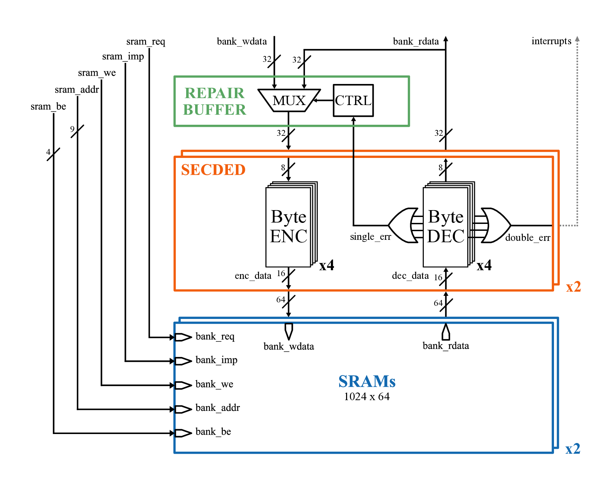

# Croc System-on-Chip: Byte-Level Hardware SECDED

This repository details the reliability enhancement of the Croc SoC via a hardware-based memory protection subsystem. For an in-depth technical analysis and comprehensive evaluation, please refer to the **[Final_Report.pdf](doc/Final_Report.pdf)**.

## Project Motivation

The primary focus of this project is to maximize the reliability of the Croc SoC rather than its raw performance. By integrating a robust error correction algorithm directly into the memory subsystem, the chip becomes highly suitable for microcontrollers operating in space missions or high-radiation environments, where ionizing particles frequently cause unintentional bit flips.

## Hardware SECDED & Inverted Hsiao Algorithm

The system utilizes a Single Error Correction, Double Error Detection (SECDED) mechanism implemented entirely in hardware.

* **Algorithm Selection:** The Inverted Hsiao algorithm was chosen because it results in a more balanced critical path and a lower total gate count, significantly reducing propagation latency compared to irregular trees typically generated by Hamming implementations.

* **Combinatorial Efficiency:** A hardware codec enables combinatorial, single-cycle error detection and correction. This ensures that memory accesses maintain their timing requirements without stalling the processor, thereby avoiding the massive computational overhead that a software-based approach would introduce for every load and store operation.

## Byte-Level Architecture

* **Native Alignment:** To natively support RISC-V byte-aligned operations, a byte-level SECDED was designed where each 8-bit byte is independently encoded into 13 bits (8 data bits + 5 parity bits).

* **Memory Scaling:** To accommodate the additional parity bits, the system memory was upgraded from baseline 32-bit structures to 64-bit wide SRAM blocks.

* **Performance Prioritization:** This architectural choice deliberately prioritizes deterministic performance and high throughput by bypassing the latency penalties inherent to Read-Modify-Write (RMW) cycles utilized in conventional ECC configurations.

* **Area Constraints:** Because the Croc chip is pad-limited—constrained by the large number of I/O pads rather than standard cell or memory area—the design can comfortably afford the additional logic and memory width required to maintain simplicity and improve latency.

* **Memory Overhead:** The resulting 12-bit overhead per memory bank is intentionally left unutilized during both read and write operations at this initial stage of the design.

## Implementation Details

* **Codec Distribution:** One hardware SECDED encoder and decoder unit is instantiated for each individual byte of the original 32-bit data word. Because the architecture features two parallel SRAM blocks, a total of eight codec units are deployed.

* **Transparent Interception:** The hardware layer transparently intercepts the memory interface signals. Consequently, the processing core and peripheral subsystems operate without modification, receiving and loading identical data patterns as they did before the upgrade.

* **Fault Trapping:** Uncorrectable double-bit errors are aggregated across all bytes via a logical OR and routed to the processor's `interrupts_o` port. This triggers an immediate hardware interrupt, allowing the RISC-V core to trap the fatal fault and prevent silent data corruption.

